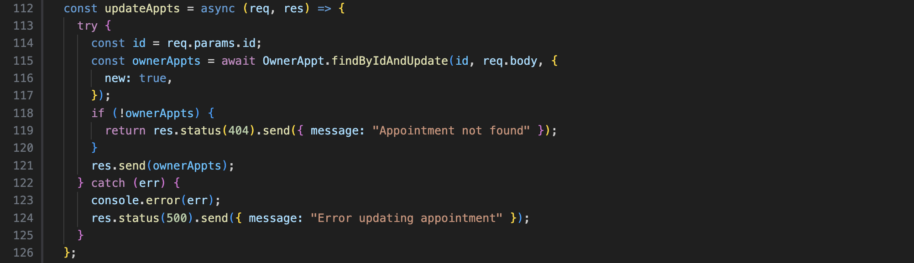
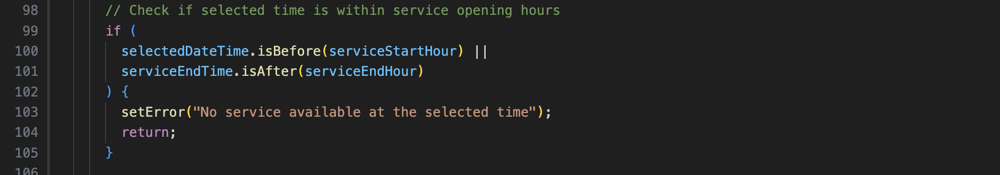

# hotdog

A hotdog stand for all your doggy appointments.

---

## Description / User Story

## Getting Started - Planning

#### Project Time Frame

2.5 weeks

### [Trello Board](https://trello.com/b/baanBY4E/hotdog)

###  ERD 

### WireFrame in [Figma](https://www.figma.com/board/7wnZVosgaE0QaFPJUtcU9Z/Project-4?node-id=0-1&t=1dzTM2a8X56toXq8-0)

### Example Schema in [Google Sheets](https://docs.google.com/spreadsheets/d/1Wf9Y4I4FwGgeJHnZQdMfJRzvozbgLiwgff7bcOgt40g/edit?gid=0#gid=0)

### Deployed on Render

Try it here: (https://hotdog-ypkn.onrender.com/)

### Screenshots
- Allows for 2 types of users with different sign up forms, profile, and appointments page.

- Two user types
  

- Login 
  

- Profile Page (Vendor)
  

- Profile Page (pet owner)
  

- Appointments Page (Vendor)
  

- Appointments Page (pet owner)
  

- Add Appointments Page (pet owner)
  

- Search Page (pet owner)
  

- Archives Page (pet owner)
  

### password hashing
 

### navigation responds to user login status.
 (g)

### Favourite Modal
- 2 Referencing points
1. ServiceId
2. UserId

### Favourite Controller

### Favourite React Component - View

### Routing / API

- User Routes

- Appointment Routes

### different access to the APIs and Webpages

### CRUD (Fetch method)

1. users

- create
  

- read
  

- update
  

2. Appointments

- create

  

- read
restricting CUD data functionality to authenticated users
  

- update
  

- delete
  

### Validation
- Duplicate bookings

- Overlapping bookings

condition:

condition:

### Biggest Challenge

- formatting time and dates
- moving the checking logic backend

### Key Takeaways

- understand the correct way to do validation backend so I only fetch necessary data frontend
- took more time to do styling and reinforced some css fundamentals

---

### MERN Tech Stack

##### Programming Language

- **Javascript**
- **HTML**
- **CSS**

##### Frontend

- **Vite** - Fast development build tool
- **React** - JavaScript library for building user interfaces
- **Tailwind CSS** - Utility-first CSS framework for styling

##### Backend

- **Node.js** - JavaScript runtime environment
- **Express** - Web application framework for Node.js

##### Database

- **MongoDB** - NoSQL database
- **Mongoose** - MongoDB object modeling tool

##### Authentication & Security

- **JSON Web Token (JWT)** - For creating and verifying tokens
- **jwt-decode** - Library to decode JWT tokens
- **bcrypt** - Password hashing library

##### Deployment

- **Render** - Cloud platform for deploying web applications

##### Development & Testing Tools

- **MongoDB Compass** - GUI tool for MongoDB
- **React DatePicker** - calendar input library
- **React TimePicker** - time input library
- **Moment** - Date and time formatter
- **Bruno** - API testing tool (for backend validation)
- **VS Code** - Code editor
- **Trello** - Project management tool
- **Figma** - Wireframe tool (for UI/UX design)

### Next Steps (Icebox)

- allow pet owners to host playdates and for other pet owners to be able to look for upcoming playdates to join
- uploading profile picture
- accomodate multiple dog for pet owners
- accomodate multiple vendors for the same type of service
- Telegram reminder for your appointments

---

### QnA + Feedback